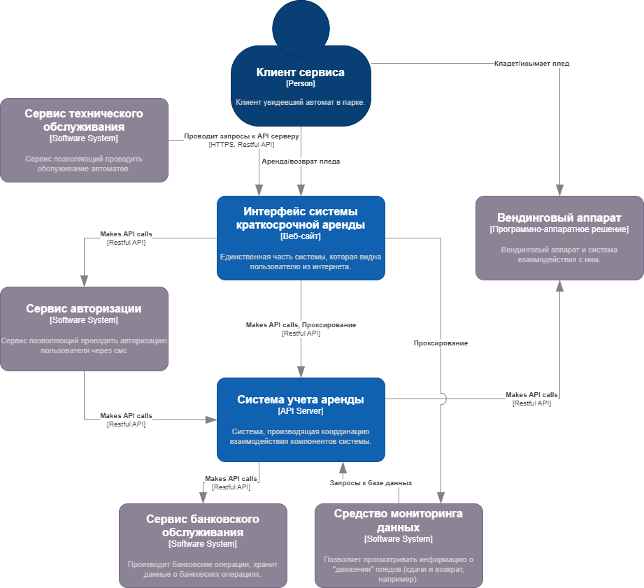

# Использование нотации C4 model для проектирования архитектуры программной системы

## Диаграмма системного контекста

## Диаграмма контейнеров

 

Для реализации выбран подтип микросервисной архитектуры: микроядерная архитектура, так как это обеспечивает защиту модулей от взлома, так как они не доступны не авторизированным пользователям сети интернет.

Доступ к системе осуществляется посредством веб-сервера, выполняющего также роль прокси. Таким образом, исключается возможность несанкционированного доступа к серверам.

В ходе разработки диаграммы контейнеров рассматривалась архитектура проектируемой системы.

Для разработки контейнера "Интерфейс системы краткосрочной аренды" было принято решение использовать стек технологий, представленный ниже:

- Для реализации "Интерфейс системы" выбрано программное решение на основе библиотеки Flutter на языке Dart. Это решение обосновано тем, что данный фреймворк позволяет компилировать приложение под платформы: Web, Android, iOS. Это значительно сокращает потенциальные трудозатраты на разработку отдельных приложений под каждую платформу.

- Для реализации "Веб сервер/Прокси" выбрано программное решение nginx, так как данное решение имеет возможность полного проксирования запросов на другую машину и разработчики уже имеют опыт его использования.

Для разработки контейнера "Система учета аренды" было принято решение использовать стек технологий представленный ниже:

- Основная часть модуля ("API Server") будет разработана с использованием библиотек ASP.NET Core, Entity Framework Core для языка C#, так как с этими технологиями знакомы все разработчики, при этом оно обеспечивает достаточную производительность. Использование данного стека позволяет автоматически генерировать документацию в соответствии с OpenAPI.

- Для реализации базы данных будет использовано СУБД PostgreSQL, так как данная СУБД распространяется бесплатно по свободной лицензии, а также у разработчиком есть опыт работы с ней.

- Для реализации "СУБД временных рядов" была выбрана база данных InfluxDB, так как данная база данных имеет гибкую настройку автоматического удаления устаревших данных, а также к данной СУБД возможно подключение программного решения "Grafana", позволяющего выполнять все поставленные задачи.

- Реализация отдельной базы данных для персональных данных обусловлена законодательством РФ, которое обязывает хранить персональные данные на серверах, имеющих дополнительные степени защиты, из-за чего их использование обходится дороже, поэтому было принято решение вынести базу персональных данных на отдельный сервер. Реализация — СУБД PostgreSQL.

## Диаграмма компонентов
