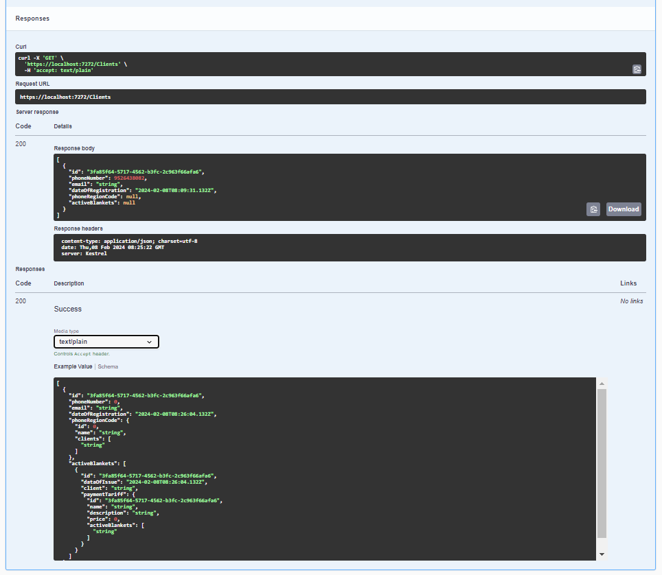
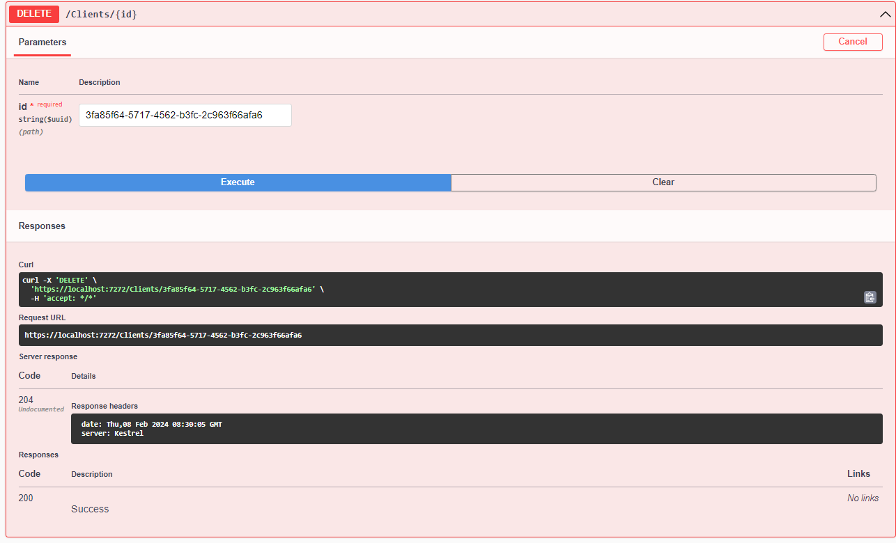
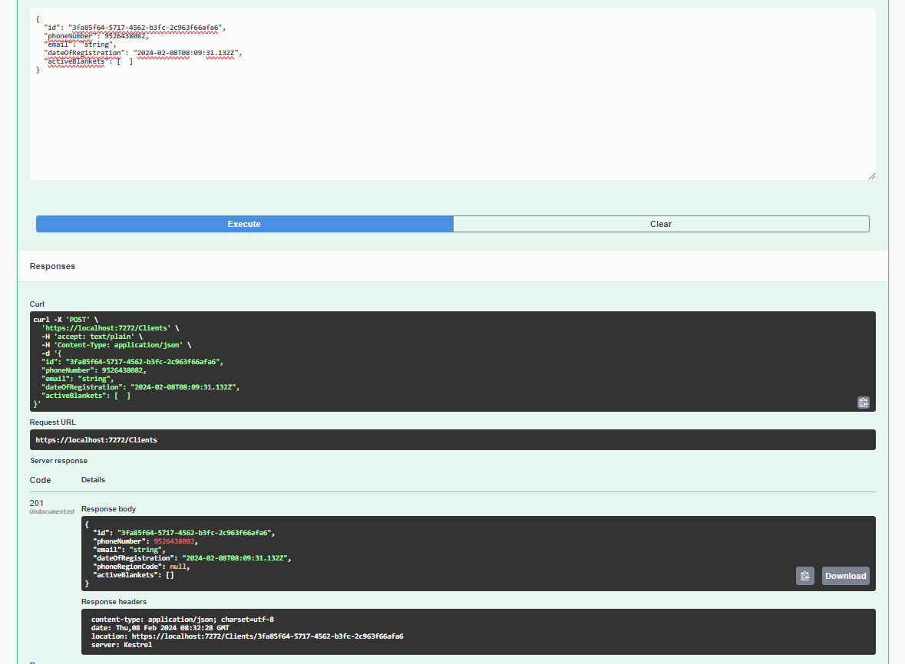
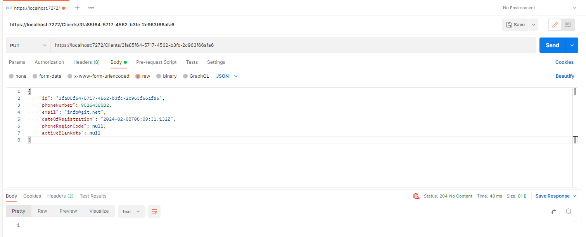
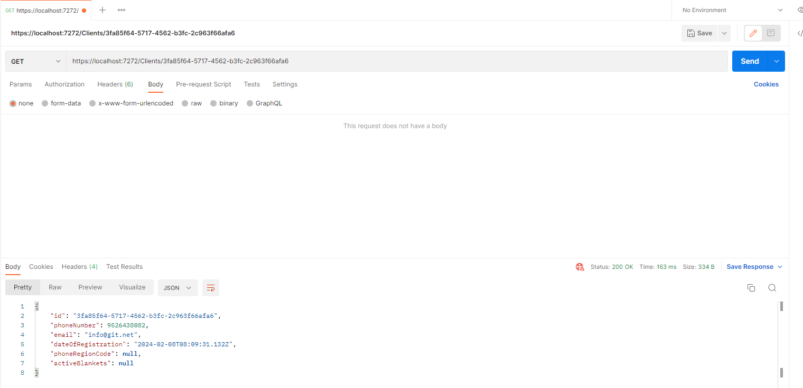

# Лабораторная работа №4

## Описание API 

Для описания API я использовал спецификацию SWAGGER, посмотреть ее можно по ссылке https://app.swaggerhub.com/apis-docs/k0perX-X/core-api/v
или в файле [html](docs/index.html) или [md](docs/index.md)

## Написание API

API для этого задания описано в контроллерах ActiveBlanketsController и ClientsController.

## Тестирование API 

Генератор документации по SWAGGER имеет функции тестирования API, поэтому для собственного удобства часть тестирования будет показана, через него, часть через Postman.

### Ручное 

#### Clients GET

Получаем полный список всех клиентов.



#### Client DELETE 

Удаляем пользователя по id.



#### Clients POST

Создаём под тем же id пользователя. API даёт значит запрос DELETE выполнился успешно



#### Clients PUT

Изменим только что созданному пользователю email.



#### Clients/id GET 

Проверим, что изменение применилось.



### Автоматические тесты Postman

#### Clients


##### Clients GET

```js
pm.test("Status code is 200", function () {
    pm.response.to.have.status(200);
});

pm.test("Response contains clients", function () {
    pm.expect(pm.response.json()).to.be.an('array').but.not.an('object')
});
```

##### Clients POST

```js
pm.test("Status code is 201", function () {
    pm.response.to.have.status(201);
});

pm.test("Response contains client data", function () {
    pm.response.to.have.jsonBody("id", "3fa85f64-5717-4562-b3fc-2c963f66afa7");
    pm.response.to.have.jsonBody("email", "string");
    pm.response.to.have.jsonBody("phoneNumber", 1234567890);
});
```

##### Clients PUT

```js
pm.test("Status code is 204", function () {
    pm.response.to.have.status(204);
});

pm.test("Response body is empty", function () {
    pm.expect(pm.response.body).to.equal(undefined)
});
```

##### Clients/id GET 

```js
pm.test("Status code is 200", function () {
    pm.response.to.have.status(200);
});

pm.test("Response contains client data", function () {
    pm.response.to.have.jsonBody("id", "3fa85f64-5717-4562-b3fc-2c963f66afa7");
    pm.response.to.have.jsonBody("email", "test@test.com");
    pm.response.to.have.jsonBody("phoneNumber", 1234567890);
});
```

##### Client DELETE 

```js
pm.test("Status code is 200", function () {
    pm.response.to.have.status(200);
});

pm.test("Response contains deleted client", function () {
    pm.response.to.have.jsonBody("id", "3fa85f64-5717-4562-b3fc-2c963f66afa7");
});
```

#### ActiveBlankets


##### ActiveBlankets GET

```js
pm.test("Status code is 200", function () {
    pm.response.to.have.status(200);
});

pm.test("Response contains ActiveBlankets", function () {
    pm.expect(pm.response.json()).to.be.an('array').but.not.an('object')
});
```

##### ActiveBlankets POST

```js
pm.test("Status code is 201", function () {
    pm.response.to.have.status(201);
});

pm.test("Response contains ActiveBlanket data", function () {
    pm.response.to.have.jsonBody("id", "3fa85f64-5717-4562-b3fc-2c963f66afa7");
    pm.response.to.have.jsonBody("dataOfIssue", "2024-02-15T15:30:55.13Z");
});
```

##### ActiveBlankets PUT

```js
pm.test("Status code is 204", function () {
    pm.response.to.have.status(204);
});

pm.test("Response body is empty", function () {
    pm.expect(pm.response.body).to.equal(undefined)
});
```

##### ActiveBlankets/id GET 

```js
pm.test("Status code is 200", function () {
    pm.response.to.have.status(200);
});

pm.test("Response contains ActiveBlanket data", function () {
    pm.response.to.have.jsonBody("id", "3fa85f64-5717-4562-b3fc-2c963f66afa7");
    pm.response.to.have.jsonBody("dataOfIssue", "2024-02-15T20:30:55.13Z");
});
```

##### ActiveBlankets DELETE 

```js
pm.test("Status code is 200", function () {
    pm.response.to.have.status(200);
});

pm.test("Response contains deleted ActiveBlanket", function () {
    pm.response.to.have.jsonBody("id", "3fa85f64-5717-4562-b3fc-2c963f66afa7");
});
```
