# Шаблоны проектирования

## Порождающие шаблоны

### Простая фабрика

В объектно ориентированном программировании фабрикой называется объект, создающий другие объекты. Формально фабрика — это функция или метод, возвращающая объекты разных прототипов или классов из вызова какого-то метода, который считается новым.

**Код**

```c#
// интерфейс автоматов
interface VendMachine
{
    public decimal getWidth();
    public decimal getHeight();
}

// реализация 
class VendMachineWithCells: VendMachine
{
    private decimal width;
    private decimal height;

    public VendMachineWithCells(decimal width, decimal height)
    {
        this.width = width;
        this.height = height;
    }

    public decimal getWidth() {
        return width;
    }

    public decimal getHeight() {
        return height;
    }
}


// Фабрика
public static class VendMachineFactory
{
    public static VendMachine makeVend(decimal width, decimal height)
    {
        return new VendMachineWithCells(width, height);
    }
}
```

**Схема**

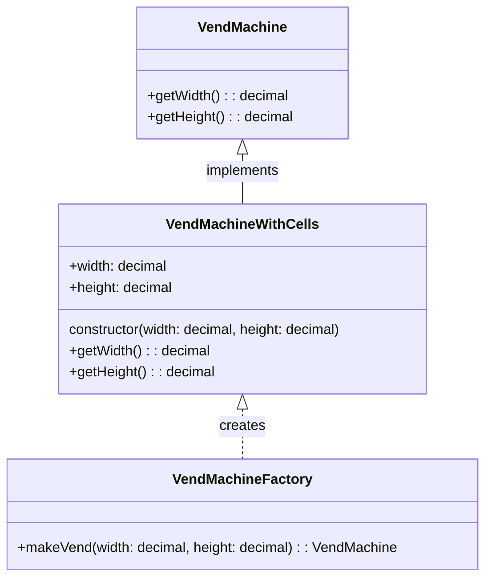


### Абстрактная фабрика

Шаблон «Абстрактная фабрика» описывает способ инкапсулирования группы индивидуальных фабрик, объединённых некой темой, без указания для них конкретных классов.
Абстрактная фабрика - это способ организации создания связанных объектов без необходимости знать о конкретных классах этих объектов.

**Код**

```C#
// интерфейс автоматов
interface VendMachine
{
    public string getDescription();
}

// реализация с ячейками
class VendMachineWithCells: VendMachine
{
    public string getDescription() { return "Автомат ячеечного типа"; }
}

// реализация снековых автоматов
class VendMachineSnack: VendMachine
{
    public string getDescription() { return "Автомат снекового типа"; }
}

//интерфейс техника
interface Technic
{
    public string getDescription();
}

//техник ячеечного автомата
class CellTechnic: Technic
{
    public string getDescription() { return 'Я умею работать только с ячейками'; }
}

//техник снекового автомата
class SnackTechnic: Technic
{
    public string getDescription() { return 'Я умею работать только с блистерами'; }
}


// абстрактная фабрика
interface VendMachineFactory
{
    public VendMachine makeVend();
    public Technic makeTechnic();
}

//фабрика ячеечных автоматов 
class VendMachineWithCellsFactory: VendMachineFactory
{
    public VendMachine makeVend() { return new VendMachineWithCells(); }
    public Technic makeTechnic() { return new CellTechnic(); }
}

//фабрика снековых автоматов 
class VendMachineSnackFactory: VendMachineFactory
{
    public VendMachine makeVend() { return new VendMachineSnack(); }
    public Technic makeTechnic() { return new SnackTechnic(); }
}
```

**Схема**

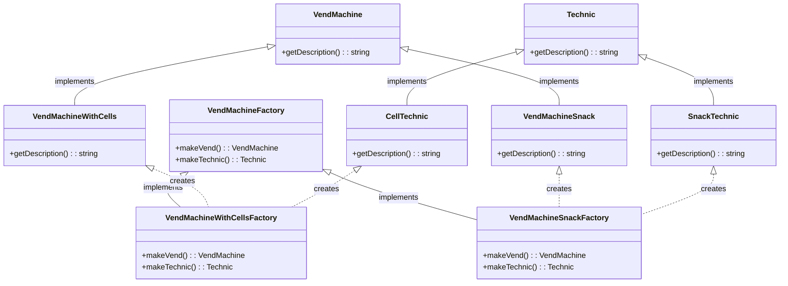

### Одиночка

Шаблон «Одиночка» позволяет ограничивать создание класса единственным объектом. Это удобно, когда для координации действий в рамках системы требуется, чтобы объект был единственным в своём классе. Таким образом, одиночка - это способ создания класса таким образом, чтобы он имел только один экземпляр и предоставлял глобальную точку доступа к этому экземпляру.

**Код**

```C#
// Класс управления вендинговыми автоматами (Одиночка)
class VendingMachineManager {
    private static instance: VendingMachineManager;

    private VendingMachineManager() { }

    public static VendingMachineManager getInstance()
    {
        if (VendingMachineManager.instance == null) 
        {
            VendingMachineManager.instance = new VendingMachineManager();
        }
        return VendingMachineManager.instance;
    }
}
```

**Схема**

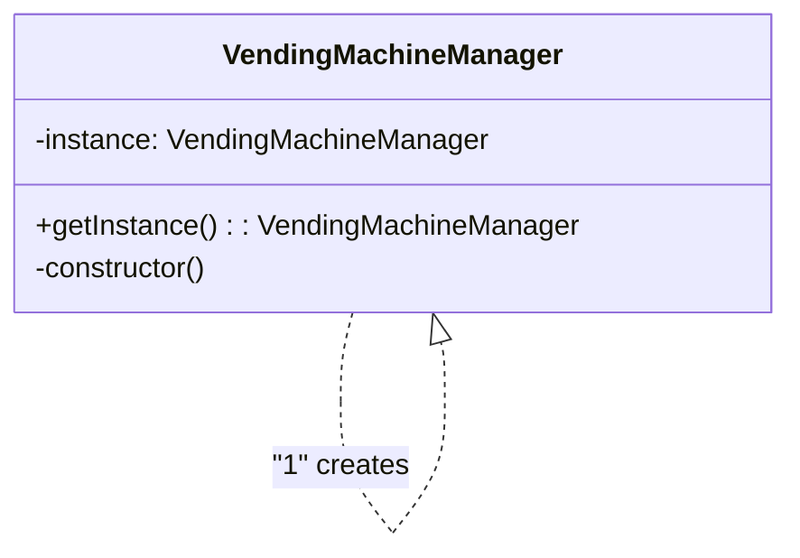

## Структурные шаблоны

### Адаптер

Шаблон проектирования «Адаптер» позволяет использовать интерфейс существующего класса как другой интерфейс. Этот шаблон часто применяется для обеспечения работы одних классов с другими без изменения их исходного кода. Таким образом, адаптер - паттерн проектирования, который позволяет объектам с несовместимыми интерфейсами работать вместе.

**Код**

```C#
// интерфейс внешней библиотеки
interface ExternalVendingMachine 
{
    public void selectProduct();
    public void pay(decimal money);
}

//внутренний интерфейс
interface VendingMachine 
{
    public void selectProduct();
    public void insertCoin(int amount);
}

// класс внешней библиотеки
class LegacyVendingMachine: ExternalVendingMachine 
{
    selectProduct() { Log.INFO("Selecting product"); }

    pay(decimal money) { Log.INFO($"Payed {money}"); }
}

//адаптер
class VendingMachineAdapter: VendingMachine 
{
    private LegacyVendingMachine legacyMachine;

    public VendingMachineAdapter(LegacyVendingMachine legacyMachine) {
        this.legacyMachine = legacyMachine;
    }    

    public VendingMachineAdapter() {
        this.legacyMachine = new LegacyVendingMachine();
    }

    public void selectProduct() {
        this.legacyMachine.selectProduct();
    }

    public void insertCoin(int amount) {
        this.legacyMachine.pay((decimal)amount);
    }
}
```

**Схема**

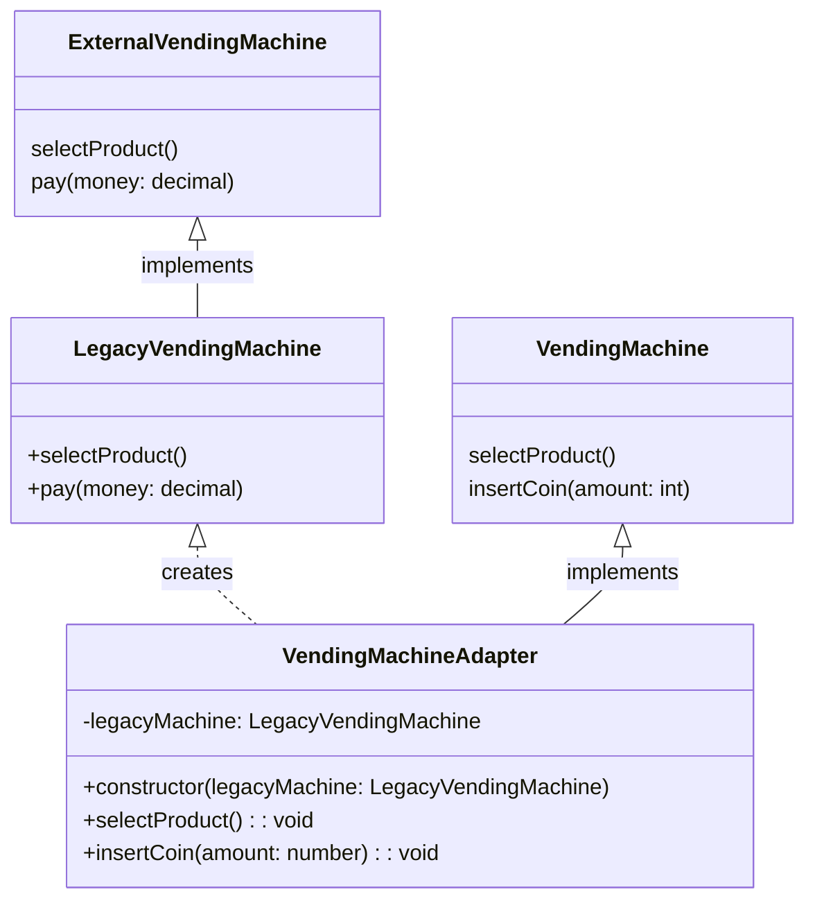

### Мост

Мост - структурный шаблон проектирования, который позволяет отделить абстракцию от реализации таким образом, чтобы они могли изменяться независимо друг от друга.

Шаблон «Мост» — это предпочтение компоновки наследованию. Подробности реализации передаются из одной иерархии другому объекту с отдельной иерархией.

**Код**

```C#
//абстракция
interface VendingMachine 
{
    public void pay(decimal money);
}

//реализация
class PaymentMethod 
{
    public void pay(decimal money);
}

//конкретная реализация - наличные
class CashPayment: PaymentMethod 
{
    pay(decimal money) { Log.INFO($"Payed {money} with cash"); }
}

//конкретная реализация - карта
class CardPayment: PaymentMethod 
{
    pay(amount: number) { Log.INFO($"Payed {money} with card"); }
}

//абстрактный класс автомата
abstract class VendingMachine 
{
    protected PaymentMethod paymentMethod;

    VendingMachine(PaymentMethod paymentMethod) 
    {
        this.paymentMethod = paymentMethod;
    }

    abstract void pay(decimal money);
}

//конкретная реализация автомата
class DrinkVendingMachine: VendingMachine 
{
    pay(decimal money) { this.paymentMethod.pay(money); }
}
```

**Схема**

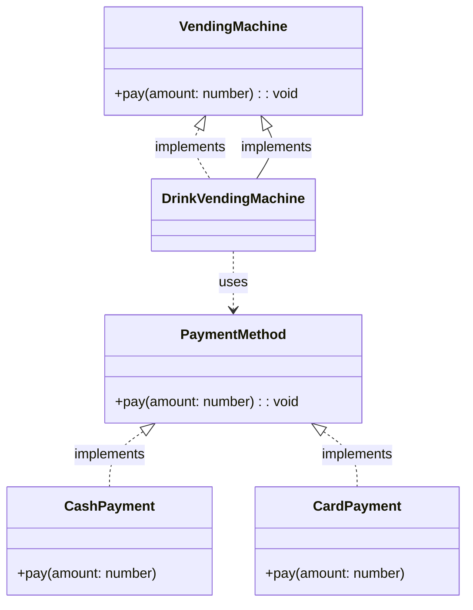

### Компоновщик

Шаблон «Компоновщик» описывает общий порядок обработки группы объектов, словно это одиночный экземпляр объекта. Суть шаблона — компонование объектов в древовидную структуру для представления иерархии от частного к целому. Шаблон позволяет клиентам одинаково обращаться к отдельным объектам и к группам объектов.

Компоновщик — структурный шаблон проектирования, который позволяет клиентам обращаться к отдельным объектам и композициям объектов одинаковым образом. Он позволяет создавать древовидные структуры из объектов и работать с ними так, будто это одиночные объекты.

**Код**

```C#
// Компонент
interface VendingComponent 
{
    public decimal getPrice();
}

// Листовой компонент - продукт
class Product: VendingComponent 
{
    private decimal price;

    constructor(decimal price) { this.price = price; }

    public decimal getPrice() 
    {
        return this.price;
    }
}

// Контейнерный компонент - группа продуктов
class ProductGroup: VendingComponent 
{
    private List<VendingComponent> products = new List<VendingComponent>();

    addProduct(VendingComponent product) 
    {
        this.products.Add(product);
    }

    public decimal getPrice(): number 
    {
        return this.products.Sum();
    }
}
```

**Схема**

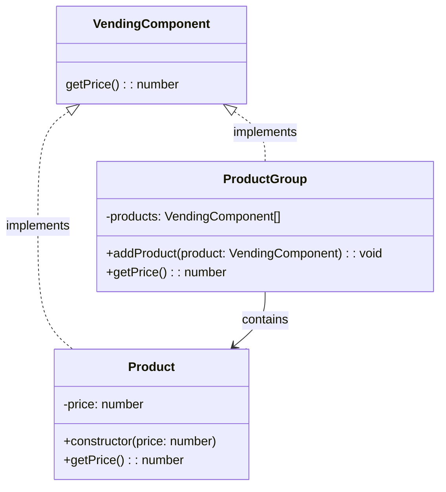

### Декоратор

Шаблон «Декоратор» позволяет подключать к объекту дополнительное поведение (статически или динамически), не влияя на поведение других объектов того же класса. Шаблон часто используется для соблюдения принципа единственной обязанности (Single Responsibility Principle), поскольку позволяет разделить функциональность между классами для решения конкретных задач.

Декоратор - это структурный шаблон проектирования, который позволяет добавлять новое поведение или функциональность объекту, не изменяя его основной структуры.

**Код**

```C#
// Интерфейс продукта
interface Product 
{
    public string getDescription();
    public decimal getPrice();
}

// Конкретный продукт
class Drink: Product 
{
    getDescription() { return "Cola"; }
    getPrice() { return 1.5; }
}

//абстрактный декоратор
abstract class ProductDecorator: Product 
{
    private Product product;

    ProductDecorator(Product product) { this.product = product; }

    public string getDescription() { return this.product.getDescription(); }

    public decimal getPrice() { return this.product.getPrice(); }
}

// декоратор льда
class IceDecorator: ProductDecorator 
{
    public string getDescription() { return $"{this.product.getDescription()} with ice"; }

    public decimal getPrice() { return this.product.getPrice() + 0.3; }
}

//декоратор лимона 
class LemonDecorator: ProductDecorator 
{
    public string getDescription() { return $"{this.product.getDescription()} with lemon"; }

    public decimal getPrice() { return this.product.getPrice() + 0.5; }
}
```

**Схема**

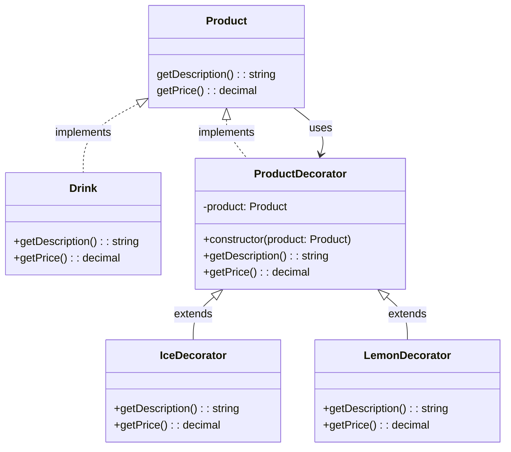

## Поведенческие шаблоны

### Цепочка обязанностей

Шаблон «Цепочка ответственности» содержит исходный управляющий объект и ряд обрабатывающих объектов. Каждый обрабатывающий объект содержит логику, определяющую типы командных объектов, которые он может обрабатывать, а остальные передаются по цепочке следующему обрабатывающему объекту.

Цепочка обязанностей - поведенческий шаблон проектирования, который позволяет передавать запросы последовательно по цепочке обработчиков, пока один из них не обработает запрос.

**Код**

```C# 
// Обработчик запроса
interface Handler 
{
    public void setNext(Handler handler);
    public void handleRequest(decimal amount);
}

// Конкретный обработчик
class StockManager: Handler 
{
    private Handler? nextHandler;

    public void setNext(Handler handler) { this.nextHandler = handler; }

    public void handleRequest(decimal amount) 
    {
        if (amount >= 10 & amount > 0) {
            Log.INFO("Stock refilled");
        } else if (this.nextHandler != null) {
            Log.INFO("Passing request to next handler");
            this.nextHandler.handleRequest(amount - 1);
        } else {
            Log.INFO("Unable to handle request");
        }
    }
}
```

**Схема**

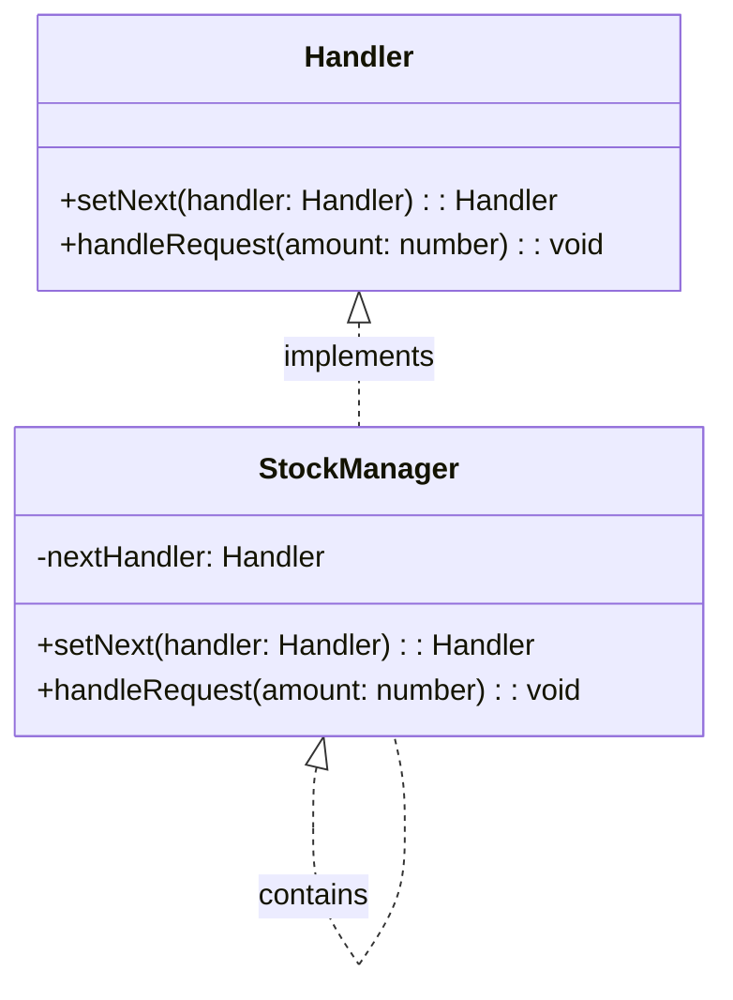

### Команда

В шаблоне «Команда» объект используется для инкапсуляции всей информации, необходимой для выполнения действия либо для его инициирования позднее. Информация включает в себя имя метода; объект, владеющий методом; значения параметров метода.

Команда - поведенческий паттерн проектирования, который превращает запросы в объекты, позволяя передавать их как аргументы при вызове методов, ставить запросы в очередь, логировать их, а также поддерживать отмену операций.

**Код**

```C#
//команда
interface Command 
{
    public void execute();
}

//получатель
class VendingMachine {
    orderDrink(): void {
        console.log("Ordering drink...");
    }
}

//конкретная команда
class OrderDrinkCommand: Command 
{
    private VendingMachine vendingMachine;

    OrderDrinkCommand(VendingMachine vendingMachine) { this.vendingMachine = vendingMachine; }

    public void execute() { this.vendingMachine.orderDrink(); }
}

//исполнитель команд
class Invoker 
{
    private Command? command;

    public void setCommand(command: Command) { this.command = command; }

    public void executeCommand()
    {
        if (this.command) {
            this.command.execute();
        } else {
            Log.WARN("No command set");
        }
    }
}
```

**Схема**

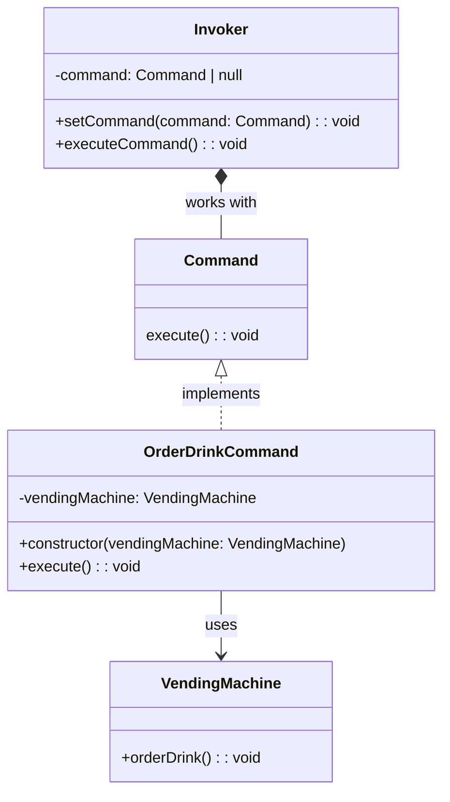

### Итератор

В этом шаблоне итератор используется для перемещения по контейнеру и обеспечения доступа к элементам контейнера. Шаблон подразумевает отделение алгоритмов от контейнера. В каких-то случаях алгоритмы, специфичные для этого контейнера, не могут быть отделены.

Итератор - поведенческий шаблон проектирования. Представляет собой объект, позволяющий получить последовательный доступ кэлементам объекта-агрегата без использования описаний каждого из агрегированных объектов.

**Код**

```C#
//итератор
interface Iterator<T> 
{
    public bool hasNext();
    public T? next();
}

//агрегатор
interface Aggregator<T>
{
    public Iterator<T> getIterator(): ;
}

//конкретный итератор
class ProductIterator<T>: Iterator<T> 
{
    private List<T> products;
    private int position;

    public ProductIterator(List<T> products) { this.products = products; }

    public bool hasNext() { return this.position < this.products.length; }

    public T? next() 
    {
        if (this.hasNext()) {
            return this.products[this.position + 1];
        } else {
            return null;
        }
    }
}

//конкретный агрегатор
class VendingMachineProducts<T>: Aggregator<T> {
    private List<T> products = new List<T>();

    public void addProduct(T product) {
        this.products.Add(product);
    }

    public Iterator<T> getIterator() { return new ProductIterator(this.products); }
}
```

**Схема**

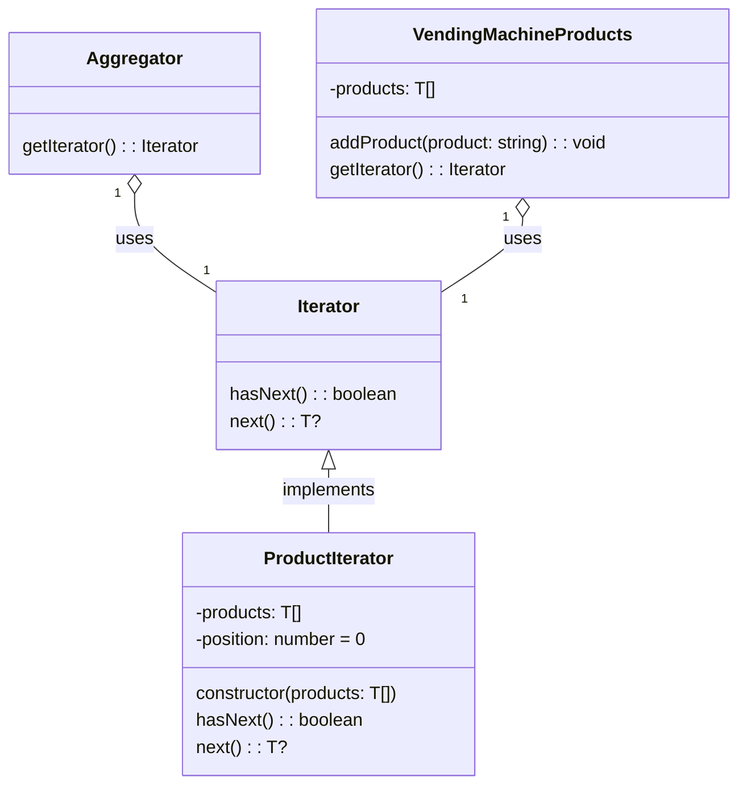

### Наблюдатель

В шаблоне «Наблюдатель» есть объект («субъект»), ведущий список своих «подчинённых» («наблюдателей») и автоматически уведомляющий их о любом изменении своего состояния, обычно с помощью вызова одного из их методов.

Наблюдатель - способ организации взаимодействия между объектами, где один объект наблюдает за изменениями в другом и автоматически получает уведомления о таких изменениях.

**Код**

```C#
// Наблюдатель
interface Observer<T> {
    public void update(T product);
}

// Конкретный наблюдатель
class Customer<T>: Observer<T> { 
    public void update(T: string) { Log.INFO($"Customer: {product} is available"); }
}

// Наблюдаемый объект
class ProductSubject<T> {
    private List<Observer> observers = List<Observer>();

    public void addObserver(Observer observer) { this.observers.Add(observer); }

    public void removeObserver(Observer observer) 
    { 
        this.observers = this.observers.Remove(observer);
    }

    public void notifyObservers(T product): void {
        this.observers.ForEach(observer => observer.update(product));
    }
}
```

**Схема**

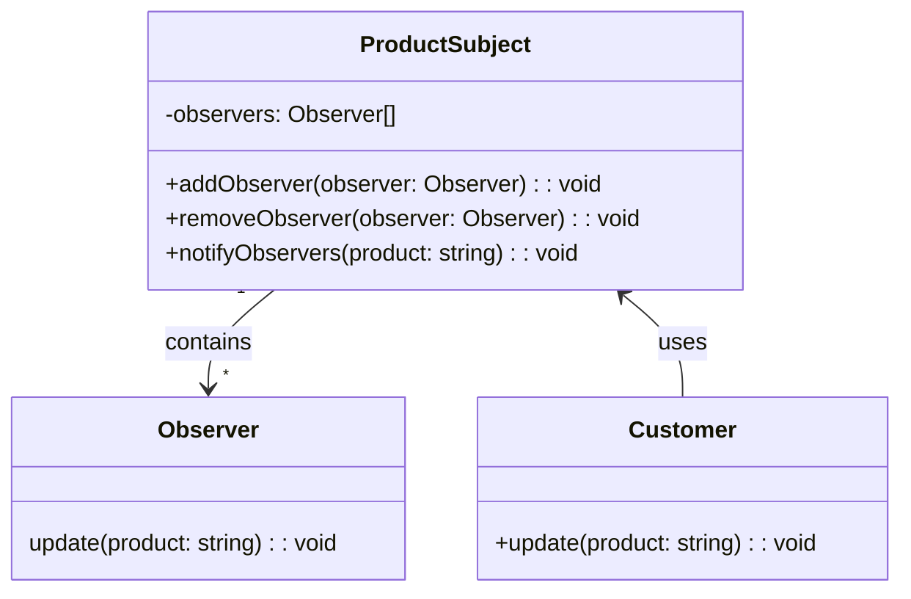

### Шаблонный метод

«Шаблонный метод» — это поведенческий шаблон, определяющий основу алгоритма и позволяющий наследникам переопределять некоторые шаги алгоритма, не изменяя его структуру в целом.

Шаблонный метод — паттерн проектирования, который определяет скелет алгоритма в базовом классе, но позволяет подклассам переопределить некоторые шаги этого алгоритма, не меняя его общей структуры.

**Код**

```C#
// Абстрактный класс вендингового автомата
abstract class VendingMachine 
{
    // Шаблонный метод
    public void processOrder() {
        this.selectProduct();
        this.processPayment();
        this.deliverProduct();
    }

    abstract void selectProduct();
    abstract void processPayment();
    abstract void deliverProduct();
}

// Конкретная реализация вендингового автомата
class DrinkVendingMachine: VendingMachine {
    public void selectProduct() { Log.INFO("Selecting drink..."); }

    public void processPayment() { Log.INFO("Processing payment for drink..."); }

    public void deliverProduct() { Log.INFO("Delivering drink..."); }
}
```

**Схема**

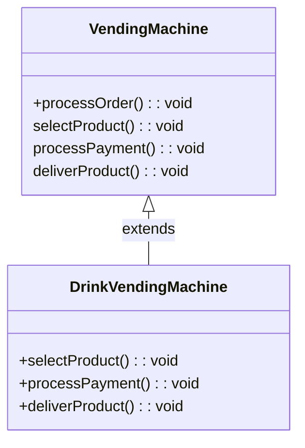
