# Шаблоны проектирования

## Порождающие шаблоны

### Фабричный метод

В объектно ориентированном программировании фабрикой называется объект, создающий другие объекты. Формально фабрика — это функция или метод, возвращающая объекты разных прототипов или классов из вызова какого-то метода, который считается новым.

**Схема**

```mermaid
classDiagram
    class Product {
        +name: string
        +price: number
    }   class Drink {
        +name: string
        +price: number
        constructor(name: string, price: number)
    }
    class VendingMachineFactory {
        +createProduct(): Product
    }
    class DrinkVendingMachineFactory {
        +createProduct(): Product
    }

    Product <|-- Drink : implements
    VendingMachineFactory <|.. DrinkVendingMachineFactory : creates
```

**Код**

```typescript
// Интерфейс продукта
interface Product {
    Name: string;
    Price: number;
}

// Класс конкретного продукта
class Drink implements Product {
    constructor(public Name: string, public Price: number) {}
}

// Фабричный метод для создания продуктов
abstract class VendingMachineFactory {
    abstract createProduct(): Product;
}

// Конкретная фабрика для создания напитков
class DrinkVendingMachineFactory extends VendingMachineFactory {
    createProduct(): Product {
        return new Drink("Cola", 1.5);
    }
}

const drinkFactory = new DrinkVendingMachineFactory();
const product = drinkFactory.createProduct();
console.log(product);

```

### Абстрактная фабрика

Абстрактная фабрика - это способ организации создания связанных объектов без необходимости знать о конкретных классах этих объектов.

**Схема**

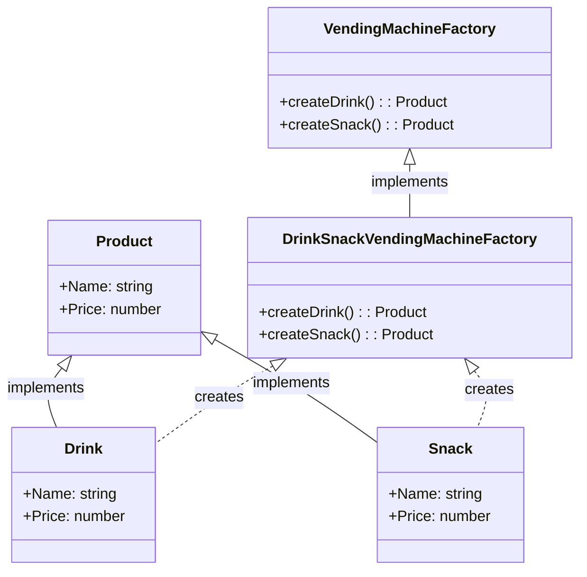

**Код**

```typescript
// Абстрактный класс продукта
abstract class Product {
    abstract Name: string;
    abstract Price: number;
}

// Конкретные продукты
class Drink extends Product {
    Name = "Cola";
    Price = 1.5;
}

class Snack extends Product {
    Name = "Chips";
    Price = 2;
}

// Абстрактная фабрика
abstract class VendingMachineFactory {
    abstract createDrink(): Product;
    abstract createSnack(): Product;
}

// Конкретная фабрика для создания напитков и закусок
class DrinkSnackVendingMachineFactory extends VendingMachineFactory {
    createDrink(): Product {
        return new Drink();
    }

    createSnack(): Product {
        return new Snack();
    }
}

const machineFactory = new DrinkSnackVendingMachineFactory();
const drink = machineFactory.createDrink();
const snack = machineFactory.createSnack();
console.log(drink); 
console.log(snack); 
```

### Одиночка

Одиночка - это способ создания класса таким образом, чтобы он имел только один экземпляр и предоставлял глобальную точку доступа к этому экземпляру.

**Схема**

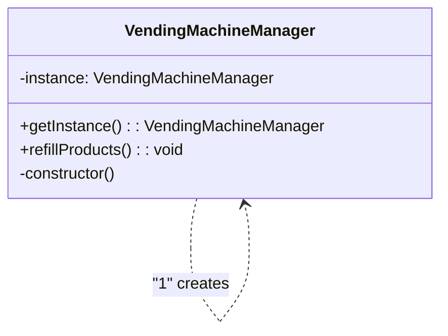

**Код**

```typescript
// Класс управления вендинговыми автоматами (Одиночка)
class VendingMachineManager {
    private static instance: VendingMachineManager;

    private constructor() {}

    static getInstance(): VendingMachineManager {
        if (!VendingMachineManager.instance) {
            VendingMachineManager.instance = new VendingMachineManager();
        }
        return VendingMachineManager.instance;
    }

    // Другие методы для управления вендинговыми автоматами
    refillProducts() {
        console.log("Refilling products...");
    }
}

const manager1 = VendingMachineManager.getInstance();
const manager2 = VendingMachineManager.getInstance();

console.log(manager1 === manager2); 
manager1.refillProducts(); 
```


## Структурные шаблоны


### Адаптер

Адаптер - паттерн проектирования, который позволяет объектам с несовместимыми интерфейсами работать вместе.

**Схема**

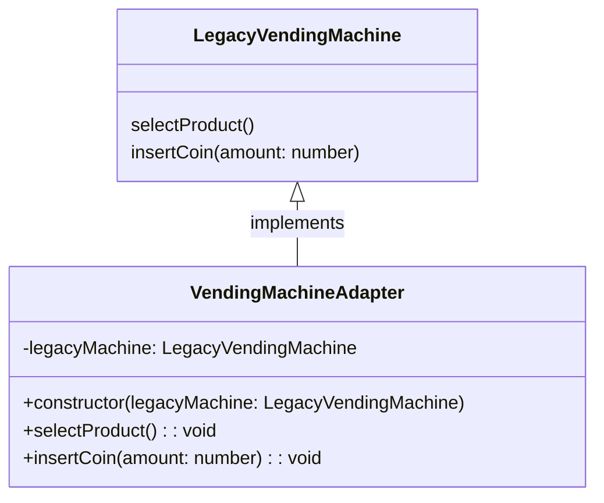

**Код**

```typescript
// Интерфейс внешней библиотеки
interface ExternalVendingMachine {
    selectProduct(): void;
    insertCoin(amount: number): void;
}

// Класс внешней библиотеки
class LegacyVendingMachine implements ExternalVendingMachine {
    selectProduct() {
        console.log("Selecting product...");
    }

    insertCoin(amount: number) {
        console.log(`Inserting ${amount} coins...`);
    }
}


class VendingMachineAdapter implements VendingMachine {
    private legacyMachine: LegacyVendingMachine;

    constructor(legacyMachine: LegacyVendingMachine) {
        this.legacyMachine = legacyMachine;
    }

    selectProduct() {
        this.legacyMachine.selectProduct();
    }

    insertCoin(amount: number) {
        this.legacyMachine.insertCoin(amount);
    }
}

const legacyMachine = new LegacyVendingMachine();
const adapter = new VendingMachineAdapter(legacyMachine);
adapter.selectProduct();
adapter.insertCoin(1.5);
```

### Мост

Мост - структурный шаблон проектирования, который позволяет отделить абстракцию от реализации таким образом, чтобы они могли изменяться независимо друг от друга.

**Схема**

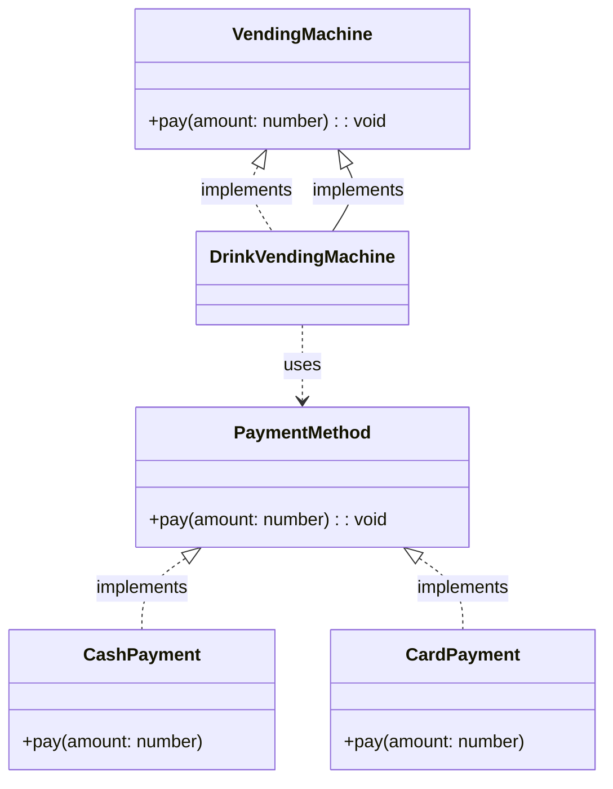

**Код**

```typescript
// Абстракция
interface VendingMachine {
    pay(amount: number): void;
}

// Реализация
interface PaymentMethod {
    pay(amount: number): void;
}

// Конкретная реализация - наличные
class CashPayment implements PaymentMethod {
    pay(amount: number) {
        console.log(`Paying ${amount} with cash...`);
    }
}

// Конкретная реализация - карта
class CardPayment implements PaymentMethod {
    pay(amount: number) {
        console.log(`Paying ${amount} with card...`);
    }
}

// Абстрактный класс автомата
abstract class VendingMachine {
    protected paymentMethod: PaymentMethod;

    constructor(paymentMethod: PaymentMethod) {
        this.paymentMethod = paymentMethod;
    }

    abstract pay(amount: number): void;
}

// Конкретная реализация автомата
class DrinkVendingMachine extends VendingMachine {
    pay(amount: number) {
        this.paymentMethod.pay(amount);
    }
}

const cashPayment = new CashPayment();
const cardPayment = new CardPayment();

const vendingMachine1 = new DrinkVendingMachine(cashPayment);
const vendingMachine2 = new DrinkVendingMachine(cardPayment);

vendingMachine1.pay(1.5);
vendingMachine2.pay(1.5);
```

### Компоновщик

Компоновщик - структурный шаблон проектирования, который позволяет клиентам обращаться к отдельным объектам и композициям объектов одинаковым образом. Он позволяет создавать древовидные структуры из объектов и работать с ними так, будто это одиночные объекты.

**Схема**

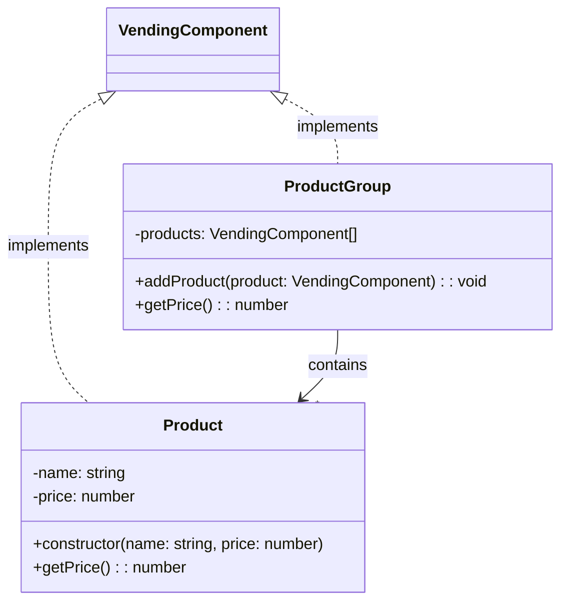

**Код**

```typescript
// Компонент
interface VendingComponent {
    getPrice(): number;
}

// Листовой компонент - продукт
class Product implements VendingComponent {
    constructor(private name: string, private price: number) {}

    getPrice(): number {
        return this.price;
    }
}

// Контейнерный компонент - группа продуктов
class ProductGroup implements VendingComponent {
    private products: VendingComponent[] = [];

    addProduct(product: VendingComponent) {
        this.products.push(product);
    }

    getPrice(): number {
        return this.products.reduce((total, product) => total + product.getPrice(), 0);
    }
}

// Использование
const cola = new Product("Cola", 1.5);
const chips = new Product("Chips", 2);

const productGroup = new ProductGroup();
productGroup.addProduct(cola);
productGroup.addProduct(chips);

console.log(productGroup.getPrice());
```

### Декоратор

Декоратор - это структурный шаблон проектирования, который позволяет добавлять новое поведение или функциональность объекту, не изменяя его основной структуры.

**Схема**

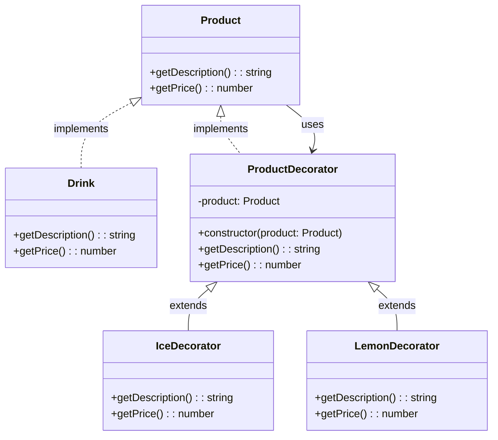

**Код**

```typescript
// Интерфейс продукта
interface Product {
    getDescription(): string;
    getPrice(): number;
}

// Конкретный продукт
class Drink implements Product {
    getDescription() {
        return "Cola";
    }

    getPrice() {
        return 1.5;
    }
}

// Декоратор
abstract class ProductDecorator implements Product {
    constructor(protected product: Product) {}

    getDescription(): string {
        return this.product.getDescription();
    }

    getPrice(): number {
        return this.product.getPrice();
    }
}

// Конкретные декораторы
class IceDecorator extends ProductDecorator {
    getDescription(): string {
        return `${this.product.getDescription()} with ice`;
    }

    getPrice(): number {
        return this.product.getPrice() + 0.5;
    }
}

class LemonDecorator extends ProductDecorator {
    getDescription(): string {
        return `${this.product.getDescription()} with lemon`;
    }

    getPrice(): number {
        return this.product.getPrice() + 0.3;
    }
}

let drink: Product = new Drink();
console.log(drink.getDescription(), drink.getPrice()); 

drink = new IceDecorator(drink);
console.log(drink.getDescription(), drink.getPrice()); 

drink = new LemonDecorator(drink);
console.log(drink.getDescription(), drink.getPrice()); 
```

## Поведенческие шаблоны

### Цепочка обязанностей

Цепочка обязанностей - поведенческий шаблон проектирования, который позволяет передавать запросы последовательно по цепочке обработчиков, пока один из них не обработает запрос.

**Схема**

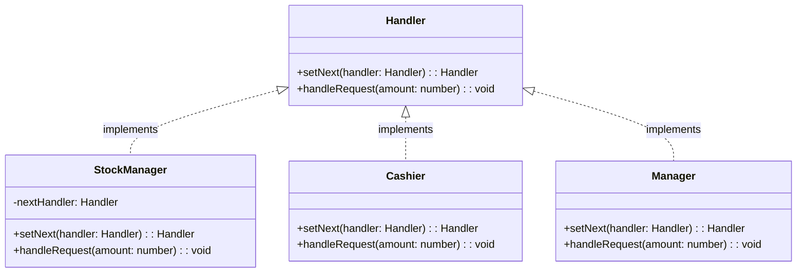

**Код**

```typescript
// Обработчик запроса
interface Handler {
    setNext(handler: Handler): Handler;
    handleRequest(amount: number): void;
}

// Конкретный обработчик
class StockManager implements Handler {
    private nextHandler: Handler;

    setNext(handler: Handler): Handler {
        this.nextHandler = handler;
        return handler;
    }

    handleRequest(amount: number): void {
        if (amount >= 10) {
            console.log("Stock refilled");
        } else if (this.nextHandler) {
            console.log("Passing request to next handler");
            this.nextHandler.handleRequest(amount);
        } else {
            console.log("Unable to handle request");
        }
    }
}


const stockManager = new StockManager();
stockManager.setNext(new Cashier()).setNext(new Manager()); // Cashier - абстрактный получатель команды, например, для проведения оплаты продукта

stockManager.handleRequest(15); // Output: Stock refilled
stockManager.handleRequest(5);  // Output: Passing request to next handler
```

### Команда

Команда - поведенческий паттерн проектирования, который превращает запросы в объекты, позволяя передавать их как аргументы при вызове методов, ставить запросы в очередь, логировать их, а также поддерживать отмену операций.

**Схема**

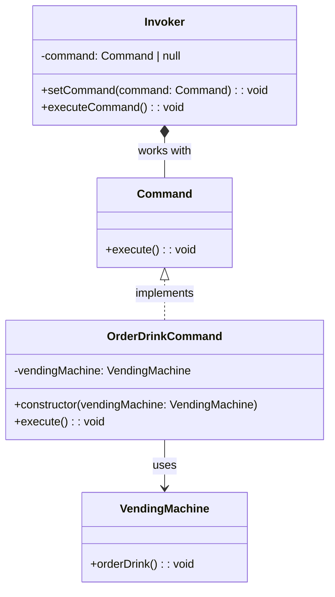

**Код**

```typescript
// Команда
interface Command {
    execute(): void;
}

// Конкретная команда
class OrderDrinkCommand implements Command {
    constructor(private vendingMachine: VendingMachine) {}

    execute(): void {
        this.vendingMachine.orderDrink();
    }
}

// Получатель
class VendingMachine {
    orderDrink(): void {
        console.log("Ordering drink...");
    }
}

// Исполнитель команд
class Invoker {
    private command: Command | null = null;

    setCommand(command: Command): void {
        this.command = command;
    }

    executeCommand(): void {
        if (this.command) {
            this.command.execute();
        } else {
            console.log("No command set");
        }
    }
}

const vendingMachine = new VendingMachine();
const orderDrinkCommand = new OrderDrinkCommand(vendingMachine);
const invoker = new Invoker();

invoker.setCommand(orderDrinkCommand);
invoker.executeCommand(); 
```

### Итератор

Итератор - поведенческий шаблон проектирования. Представляет собой объект, позволяющий получить последовательный доступ кэлементам объекта-агрегата без использования описаний каждого из агрегированных объектов.

**Схема**

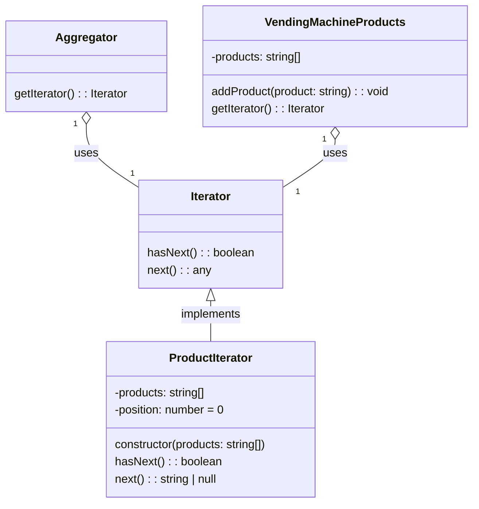

**Код**

```typescript
// Итератор
interface Iterator<T> {
    hasNext(): boolean;
    next(): T | null;
}

// Агрегат
interface Aggregator {
    getIterator(): Iterator<string>;
}

// Конкретный итератор
class ProductIterator implements Iterator<string> {
    private products: string[];
    private position: number = 0;

    constructor(products: string[]) {
        this.products = products;
    }

    hasNext(): boolean {
        return this.position < this.products.length;
    }

    next(): string | null {
        if (this.hasNext()) {
            return this.products[this.position++];
        } else {
            return null;
        }
    }
}

// Конкретный агрегат
class VendingMachineProducts implements Aggregator {
    private products: string[] = [];

    addProduct(product: string): void {
        this.products.push(product);
    }

    getIterator(): Iterator<string> {
        return new ProductIterator(this.products);
    }
}

const vendingMachineProducts = new VendingMachineProducts();
vendingMachineProducts.addProduct("Cola");
vendingMachineProducts.addProduct("Chips");

const iterator = vendingMachineProducts.getIterator();
while (iterator.hasNext()) {
    console.log(iterator.next());
}
```

### Наблюдатель

Наблюдатель - способ организации взаимодействия между объектами, где один объект наблюдает за изменениями в другом и автоматически получает уведомления о таких изменениях.

**Схема**

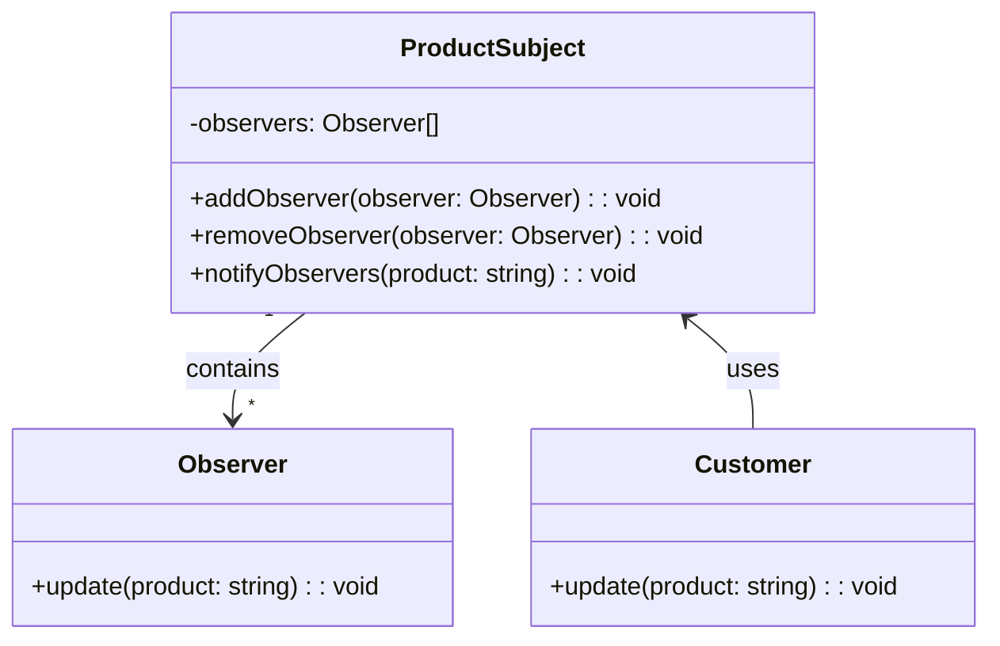

**Код**

```typescript
// Наблюдаемый объект
class ProductSubject {
    private observers: Observer[] = [];

    addObserver(observer: Observer): void {
        this.observers.push(observer);
    }

    removeObserver(observer: Observer): void {
        this.observers = this.observers.filter(o => o !== observer);
    }

    notifyObservers(product: string): void {
        this.observers.forEach(observer => observer.update(product));
    }
}

// Наблюдатель
interface Observer {
    update(product: string): void;
}

// Конкретный наблюдатель
class Customer implements Observer {
    update(product: string): void {
        console.log(`Customer: ${product} is available`);
    }
}

const productSubject = new ProductSubject();
const customer1 = new Customer();
const customer2 = new Customer();

productSubject.addObserver(customer1);
productSubject.addObserver(customer2);

productSubject.notifyObservers("Cola");
```

### Шаблонный метод

Шаблонный метод — паттерн проектирования, который определяет скелет алгоритма в базовом классе, но позволяет подклассам переопределить некоторые шаги этого алгоритма, не меняя его общей структуры.

**Схема**

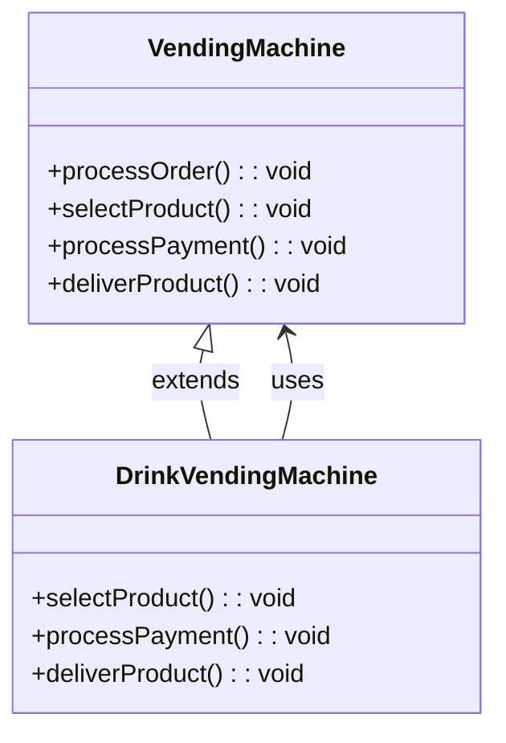

**Код**

```typescript
// Абстрактный класс вендингового автомата
abstract class VendingMachine {
    // Шаблонный метод
    processOrder(): void {
        this.selectProduct();
        this.processPayment();
        this.deliverProduct();
    }

    abstract selectProduct(): void;
    abstract processPayment(): void;
    abstract deliverProduct(): void;
}

// Конкретная реализация вендингового автомата
class DrinkVendingMachine extends VendingMachine {
    selectProduct(): void {
        console.log("Selecting drink...");
    }

    processPayment(): void {
        console.log("Processing payment for drink...");
    }

    deliverProduct(): void {
        console.log("Delivering drink...");
    }
}

const drinkVendingMachine = new DrinkVendingMachine();
drinkVendingMachine.processOrder();
```